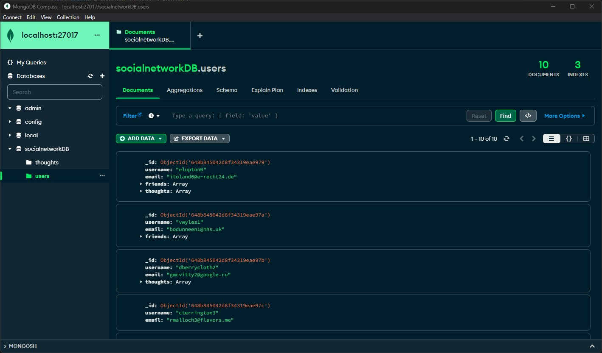
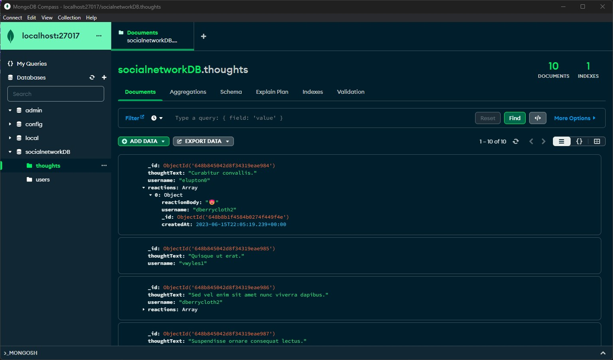
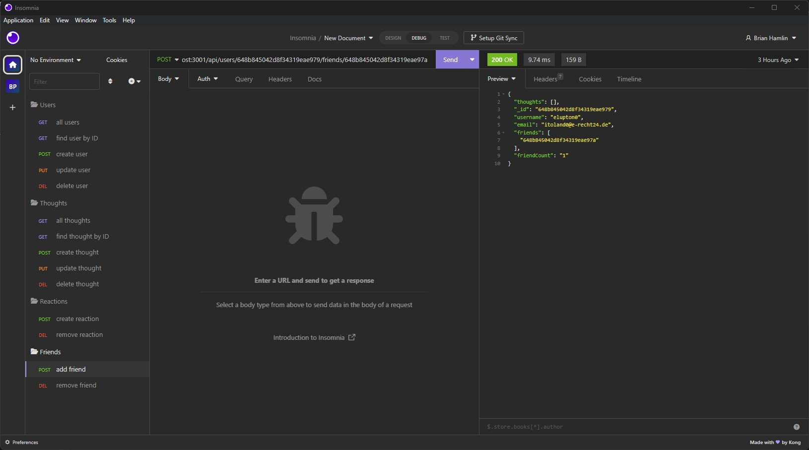
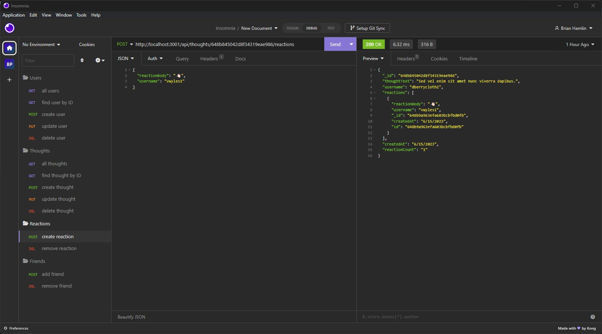

# Social Network API

## Table of Contents 
* [Description](#Description) 

* [Installation](#Installation) 

* [Usage](#Usage) 

* [License](#License) 

* [Contributing](#Contributing) 

* [Testing](#Testing) 

* [Questions](#Questions) 

* [Screenshots](#Screenshots) 

### Description
MongoDB backend using mongoose ODM, to be paired with a social networking front end. Provides full CRUD functionality with multiple api endpoints which pull dynamic content from within a mongo database.

### Installation
1. Ensure MongoDB daemon is running. For detailed information, please reference MongoDB documentation via <a href="https://www.mongodb.com/">https://www.mongodb.com/</a>.
2. `npm install` into root directory, to install required application dependencies.
    - [optional] `npm run seed` to seed database with pre-supplied data.
3. `npm start` to start application.

### Usage
Available npm scripts:
- start
- watch
- seed

| Available /api routes | Request Types |
| :--- | :--- |
| /users  | .get  |
| | .post |
| /users:userId | .get |
| | .put |
| | .delete |
| /users/:userId/friends/:friendId | .post |
| | .delete |
| /thoughts | .get |
| | .post |
| /thoughts/:thoughtId | .get |
| | .put |
| | .delete |
| /thoughts/:thoughtId/reactions | .post |
| /thoughts/:thoughtId/reactions/:reactionId | .delete |

### License
Further information regarding this specific license can be found via: https://opensource.org/license/mit/.  

### Contributing
Open <a href="https://github.com/MisterBham/socialnetwork-api/issues">Issues</a> on the Github repo!

### Testing
No unit testing provided at this time

### Questions
Should you have any further questions, please reach the developer at: misterbham.dev@gmail.com.   
GitHub: <a href="https://github.com/MisterBham">MisterBham</a>.   

### Screenshots
   
   
   
   
